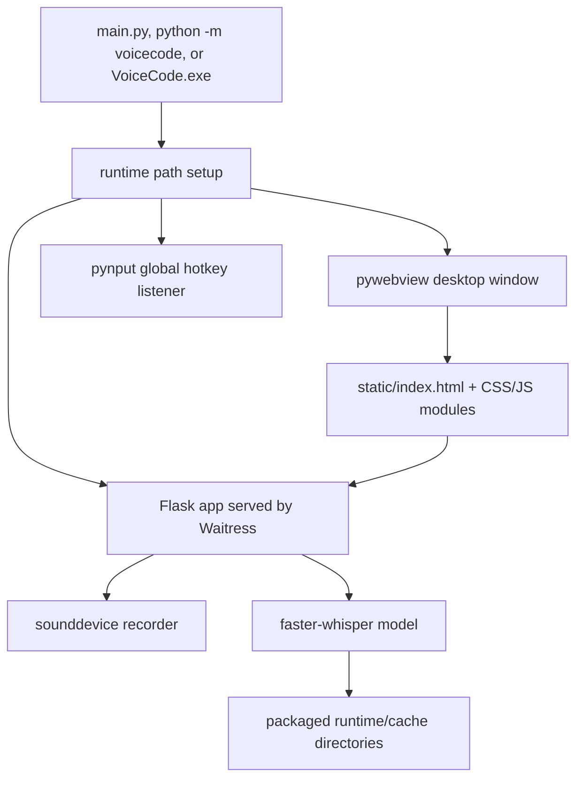

# AGENTS.md

Repository-specific guidance for coding agents working on VoiceCode.

## Commands

```powershell
python -m pip install -e ".[dev]"                         # Dev setup
pre-commit install                                         # Optional local hooks
python -m voicecode                                        # Run packaged app
python main.py                                             # Run source-tree compatibility entry
python -m pytest                                           # Smoke tests
python -m ruff check app.py main.py tests src/voicecode     # Lint
python -m ruff format app.py main.py tests src/voicecode    # Format
python -m mypy app.py main.py src/voicecode                 # Type-check
python -m pip wheel . --no-deps -w dist                     # Build wheel
powershell -NoProfile -ExecutionPolicy Bypass -File .\packaging\installer\build-installer.ps1  # Build Windows installer
```

Use PowerShell with UTF-8 enabled. Prefer `run.ps1` / `setup.ps1` on Windows. If local execution policy blocks scripts, use `powershell -NoProfile -ExecutionPolicy Bypass -File ...` for repository scripts instead of changing system policy.

## Current Project Shape

This repository is a compact VoiceCode desktop app:

- Root compatibility entry points: `app.py`, `main.py`
- Installable package: `src/voicecode/`
- Runtime path helper: `src/voicecode/runtime.py`
- Static UI: `static/index.html` and packaged copy `src/voicecode/static/index.html`
- Split frontend assets: `static/css/`, `static/js/`, mirrored under `src/voicecode/static/`
- Tests: `tests/test_app_smoke.py`
- Release packaging: `packaging/installer/`, `packaging/pyinstaller/`, `packaging/windows/`
- Release metadata: `pyproject.toml`, `MANIFEST.in`, CI workflow, docs, contribution/security files

The installable package under `src/voicecode` is authoritative. Root `app.py` and `main.py` are compatibility wrappers, while static assets are mirrored for source-tree and packaged execution.

## Runtime Model



## Important Constraints

- The local HTTP server must bind to `127.0.0.1` only.
- Startup must verify `/health` returns the current process PID; repeated launches and unrelated services on the configured port must fail clearly.
- Console output should be UTF-8 safe for PowerShell and cmd.
- Logs, exceptions, API errors, and script output should be English.
- Non-empty API JSON request bodies must be valid objects; malformed JSON, JSON `null`, arrays, strings, numbers, and booleans should return `400` without side effects.
- Config must be written to a user-writable path:
  - Windows: `%APPDATA%\VoiceCode\config.json`
  - Unix: `$XDG_CONFIG_HOME/voicecode/config.json` or `~/.config/voicecode/config.json`
- Do not write config into the installed package directory.
- Packaged Windows builds should keep future model/download caches under the selected install directory:
  - `<install-dir>\runtime\cache`
  - `<install-dir>\runtime\models`
- Use `VOICECODE_CONFIG_FILE`, `VOICECODE_STATIC_DIR`, and `VOICECODE_RUNTIME_DIR` for test/release overrides.
- Generated packaging outputs under `packaging/installer/dist`, `packaging/installer/build`, and `packaging/installer/Output` must stay ignored.

## Thread Safety

| Resource | Guard |
| --- | --- |
| Whisper model | `model_lock` (`threading.RLock`) |
| Config file I/O | `_config_lock` |
| Audio buffer + active flag | `Recorder._lock` (`threading.RLock`) |
| Model reload state | `_model_state_lock` |
| Cancellation token | `_cancel_lock` |
| Global typing flag | `_typing_lock` |
| Hotkey modifier set | listener-local lock |

## API Summary

- `GET /health`
- `GET /status`
- `GET /config`
- `POST /config`
- `POST /reload_model`
- `POST /record/start`
- `POST /record/stop`
- `POST /record/cancel`
- `POST /log`
- `GET /stats`
- `GET /models`
- `GET /audio/devices`
- `GET /history`
- `POST /history/clear`
- `GET /diagnostics`

See `docs/API.md` for request/response details.

## Installer Packaging

The recommended release installer flow is:

```powershell
powershell -NoProfile -ExecutionPolicy Bypass -File .\packaging\installer\build-installer.ps1
```

Outputs:

```text
packaging\installer\dist\VoiceCode\
packaging\installer\Output\VoiceCodeSetup-0.1.0.exe
```

The installer is based on PyInstaller one-folder output plus Inno Setup. It must allow users to choose the installation path and should default to `%LOCALAPPDATA%\Programs\VoiceCode` to avoid requiring administrator privileges.

Before release, install to both the default path and a custom path, then confirm `VoiceCode.exe`, `_internal`, `runtime`, `runtime\cache`, and `runtime\models` are present under the chosen directory.

## Before Finishing Changes

Run at least:

```powershell
python -m ruff format --check app.py main.py tests src/voicecode
python -m ruff check app.py main.py tests src/voicecode
python -m mypy app.py main.py src/voicecode
python -X utf8 -m pytest -q
```

For release-impacting changes, also run:

```powershell
python -X utf8 -m py_compile app.py main.py src/voicecode/app.py src/voicecode/main.py src/voicecode/__init__.py src/voicecode/__main__.py src/voicecode/runtime.py
python -m pip wheel . --no-deps -w dist
```

The current release-candidate smoke suite is expected to report `35 passed`.

For packaging/runtime changes, also run or justify skipping:

```powershell
powershell -NoProfile -ExecutionPolicy Bypass -File .\packaging\installer\build-installer.ps1
```
