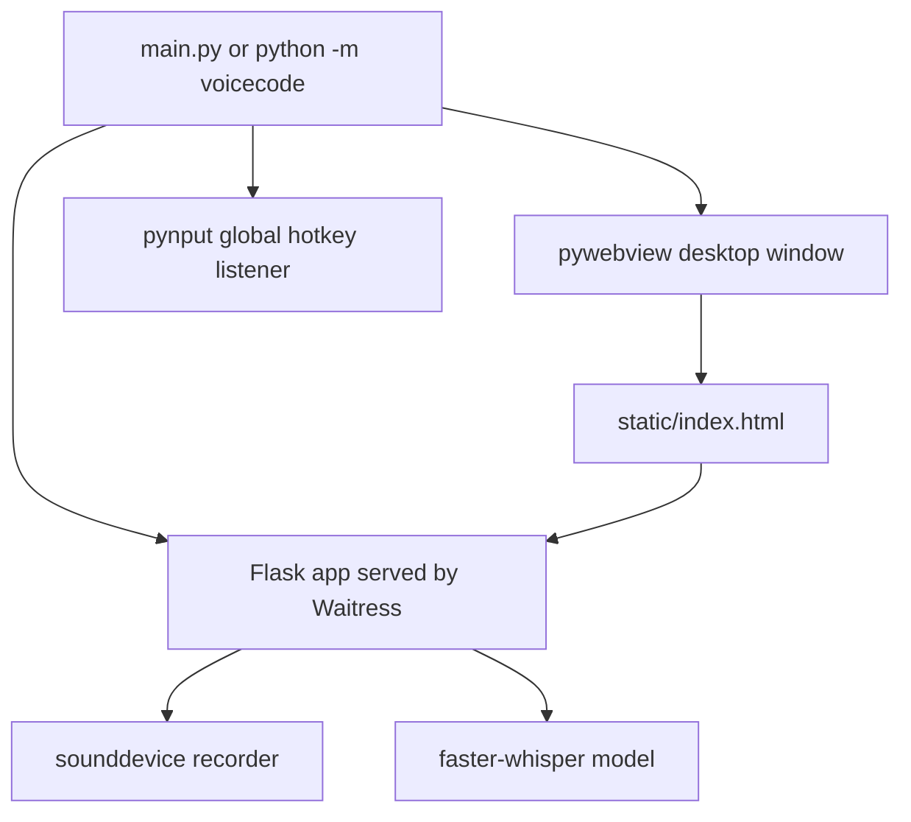

# AGENTS.md

Repository-specific guidance for coding agents working on VoiceCode.

## Commands

```powershell
python -m pip install -e ".[dev]"                         # Dev setup
pre-commit install                                         # Optional local hooks
python -m voicecode                                        # Run packaged app
python main.py                                             # Run source-tree compatibility entry
python -m pytest                                           # Smoke tests
python -m ruff check app.py main.py tests src/voicecode     # Lint
python -m ruff format app.py main.py tests src/voicecode    # Format
python -m mypy app.py main.py src/voicecode                 # Type-check
python -m pip wheel . --no-deps -w dist                     # Build wheel
```

Use PowerShell with UTF-8 enabled. Prefer `run.ps1` / `setup.ps1` on Windows.

## Current Project Shape

This repository is a compact VoiceCode desktop app:

- Root compatibility entry points: `app.py`, `main.py`
- Installable package: `src/voicecode/`
- Static UI: `static/index.html` and packaged copy `src/voicecode/static/index.html`
- Tests: `tests/test_app_smoke.py`
- Release metadata: `pyproject.toml`, `MANIFEST.in`, CI workflow, docs, contribution/security files

The root runtime files and packaged copies must stay synchronized. The smoke test `test_distribution_sources_stay_synchronized` enforces this.

## Runtime Model



## Important Constraints

- The local HTTP server must bind to `127.0.0.1` only.
- Console output should be UTF-8 safe for PowerShell and cmd.
- Logs, exceptions, API errors, and script output should be English.
- Config must be written to a user-writable path:
  - Windows: `%APPDATA%\VoiceCode\config.json`
  - Unix: `$XDG_CONFIG_HOME/voicecode/config.json` or `~/.config/voicecode/config.json`
- Do not write config into the installed package directory.
- Use `VOICECODE_CONFIG_FILE` and `VOICECODE_STATIC_DIR` for test/release overrides.

## Thread Safety

| Resource | Guard |
| --- | --- |
| Whisper model | `model_lock` (`threading.RLock`) |
| Config file I/O | `_config_lock` |
| Audio buffer + active flag | `Recorder._lock` (`threading.RLock`) |
| Model reload state | `_model_state_lock` |
| Cancellation token | `_cancel_lock` |
| Global typing flag | `_typing_lock` |
| Hotkey modifier set | listener-local lock |

## API Summary

- `GET /health`
- `GET /status`
- `GET /config`
- `POST /config`
- `POST /reload_model`
- `POST /record/start`
- `POST /record/stop`
- `POST /record/cancel`
- `POST /log`
- `GET /stats`

See `docs/API.md` for request/response details.

## Before Finishing Changes

Run at least:

```powershell
python -m ruff format --check app.py main.py tests src/voicecode
python -m ruff check app.py main.py tests src/voicecode
python -m mypy app.py main.py src/voicecode
python -X utf8 -m pytest -q
```

For release-impacting changes, also run:

```powershell
python -X utf8 -m py_compile app.py main.py src/voicecode/app.py src/voicecode/main.py src/voicecode/__init__.py src/voicecode/__main__.py
python -m pip wheel . --no-deps -w dist
```
