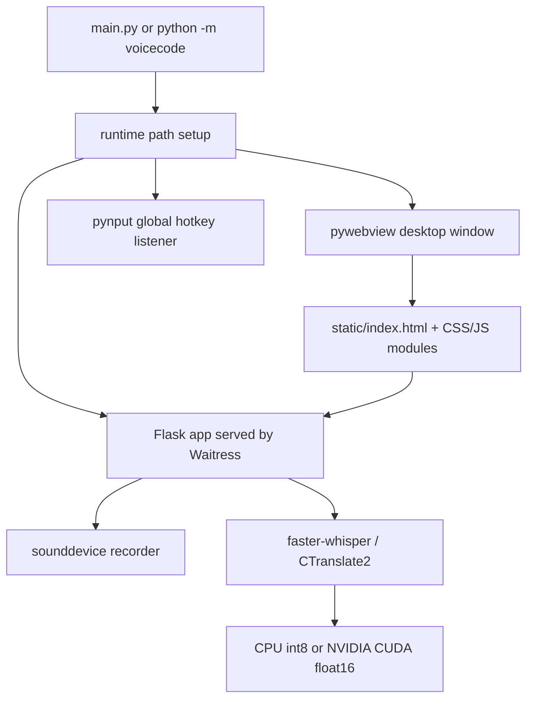

# AGENTS.md

Repository-specific guidance for coding agents working on VoiceCode.

## Commands

```powershell
python -m pip install -e ".[dev]"                         # Dev setup
pre-commit install                                         # Optional local hooks
python -m voicecode                                        # Run packaged app
python main.py                                             # Source-tree compatibility entry
python -m pytest                                           # Smoke tests
python -m ruff check app.py main.py tests src/voicecode     # Lint
python -m ruff format app.py main.py tests src/voicecode    # Format
python -m mypy app.py main.py src/voicecode                 # Type-check
python -m pip wheel . --no-deps -w dist                     # Build wheel
python -X utf8 tools/generate_icon.py                          # Regenerate icon assets
python -X utf8 packaging/windows/build_windows_installer.py    # Build Windows installer
python -X utf8 packaging/windows/verify_windows_installer.py --help # Installer smoke options
```

Use PowerShell with UTF-8 enabled on Windows. The maintained Windows installer sources live under `packaging/windows/`; generated artifacts under `dist/` and `build/` remain ignored.

## Project Shape

- Root compatibility entry points: `app.py`, `main.py`
- Installable package: `src/voicecode/`
- Runtime path helper: `src/voicecode/runtime.py`
- Route blueprints: `config_api.py`, `model_api.py`, `management_api.py`, `history_api.py`, `system_api.py`, `recording_api.py`
- Model services: `model_runtime.py`, `model_cache.py`, `transcription_service.py`
- Dependency services: `dependency_catalog.py`, `dependency_environment.py`, `dependency_installer.py`, facade `dependencies.py`
- Static UI: `static/` and packaged copy `src/voicecode/static/`, including `i18n/*.json` catalogs
- Tests: `tests/test_app_smoke.py`
- Release metadata: `pyproject.toml`, `MANIFEST.in`, CI workflow, docs, contribution/security files

The installable package under `src/voicecode` is authoritative. Static assets are mirrored for source-tree and packaged execution. Edit `src/voicecode/static`, then run `python -X utf8 tools/sync_static.py`; tests require synchronization.

## Runtime Model


```mermaid
flowchart TD
    A["main.py or python -m voicecode"] --> R["runtime path setup"]
    R --> B["Flask app served by Waitress"]
    R --> C["pywebview desktop window"]
    R --> D["pynput global hotkey listener"]
    C --> E["static/index.html + CSS/JS modules"]
    E --> B
    B --> F["sounddevice recorder"]
    B --> G["faster-whisper / CTranslate2"]
    G --> H["CPU int8 or NVIDIA CUDA float16"]
```

## Important Constraints

- The local HTTP server must bind to `127.0.0.1` only.
- Startup must verify `/health` returns the current process PID; repeated launches and unrelated services on the configured port must fail clearly.
- Console output should be UTF-8 safe for PowerShell and cmd.
- Logs, exceptions, API errors, and script output should be English.
- Non-empty API JSON request bodies must be valid objects; malformed JSON and non-object JSON must return `400` without side effects.
- Config must be written to a user-writable path:
  - Windows: `%APPDATA%\VoiceCode\config.json`
  - Unix: `$XDG_CONFIG_HOME/voicecode/config.json` or `~/.config/voicecode/config.json`
- Do not write config into the installed package directory.
- Use `VOICECODE_CONFIG_FILE`, `VOICECODE_STATIC_DIR`, `VOICECODE_RUNTIME_DIR`, and `VOICECODE_MODEL_DIR` for test/release overrides.
- Set `VOICECODE_SKIP_WARMUP` to skip the best-effort model warm-up after load.
- Generated outputs under `dist/`, `build/`, `*.egg-info`, and cache directories must stay ignored.

## Thread Safety

| Resource | Guard |
| --- | --- |
| Whisper model | `model_lock` (`threading.RLock`) |
| Config file I/O | `_config_lock` |
| Dependency status cache | `_dependency_cache_lock` |
| Reachable HF endpoint cache | `_hf_endpoint_lock` |
| Audio buffer + active flag | `Recorder._lock` (`threading.RLock`) |
| Partial draft state | `_partial_lock` |
| Model reload state | `_model_state_lock` |
| Cancellation token | `_cancel_lock` |
| Global typing flag | `_typing_lock` |
| Typing delivery serialization | `_delivery_lock` |
| Dependency task map | dependency installer `_task_lock` |
| pip install serialization | dependency installer `_install_lock` |
| Hotkey modifier set | listener-local lock |

## API Summary

- `GET /health`
- `GET /status`
- `GET /hardware`
- `GET /config`
- `POST /config`
- `GET /config/schema`
- `POST /reload_model`
- `POST /record/start`
- `POST /record/stop`
- `POST /record/cancel`
- `POST /transcribe`
- `POST /log`
- `GET /stats`
- `GET /onboarding`
- `POST /onboarding/complete`
- `POST /onboarding/reset`
- `GET /extensions`
- `POST /extensions/<id>`
- `POST /extensions/<id>/install`
- `GET /dependencies`
- `POST /dependencies/install-required`
- `GET /dependencies/tasks`
- `POST /dependencies/tasks/<id>/cancel`
- `POST /dependencies/<id>/install`
- `GET /dependencies/tasks/<id>`
- `POST /dependencies/<id>/uninstall`
- `GET /models`
- `GET /audio/devices`
- `POST /audio/test`
- `GET /history`
- `POST /history/clear`
- `GET /diagnostics`
- `GET /diagnostics/export`

See `docs/API.md` for request/response details.

## Before Finishing Changes

Run at least:

```powershell
python -m ruff format --check app.py main.py tests src/voicecode
python -m ruff check app.py main.py tests src/voicecode
python -m mypy app.py main.py src/voicecode
python -X utf8 -m pytest -q
```

For installer changes, build the setup executable and run `packaging/windows/verify_windows_installer.py` against a disposable custom path; never use its uninstall option on a production install.

For metadata/runtime changes, also run or justify skipping:

```powershell
python -X utf8 -m py_compile app.py main.py src/voicecode/app.py src/voicecode/main.py src/voicecode/__init__.py src/voicecode/__main__.py src/voicecode/runtime.py
python -m pip wheel . --no-deps -w dist
```

## Agent skills

### Issue tracker

Issues and specs for this repo live as GitHub issues, managed with the `gh` CLI. See `docs/agents/issue-tracker.md`.

### Triage labels

Five canonical roles map to `needs-triage`, `needs-info`, `ready-for-agent`, `ready-for-human`, `wontfix`. See `docs/agents/triage-labels.md`.

### Domain docs

Single-context: one root `CONTEXT.md` plus `docs/adr/`. See `docs/agents/domain.md`.
