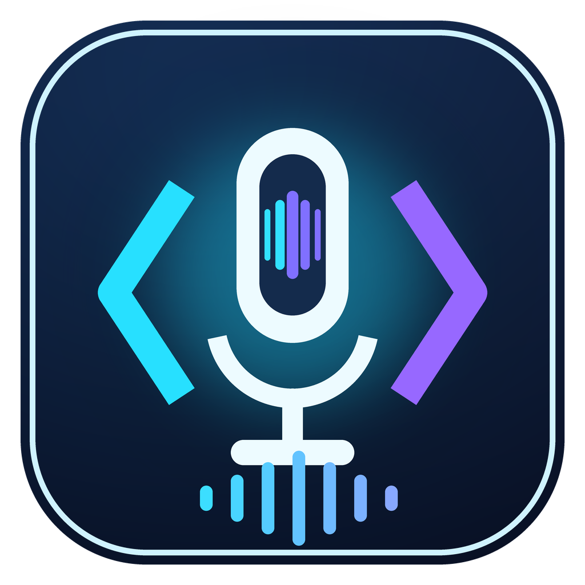

# VoiceCode



**Current release: v0.3.1**

[English](README.md) | [简体中文](README_zh.md) | [日本語](README_ja.md)

VoiceCode is a local-first desktop speech-to-text app for coding, writing, and prompt drafting. It records microphone audio, transcribes it with [faster-whisper](https://github.com/SYSTRAN/faster-whisper) / CTranslate2, and can type the result into the active application with a push-to-talk hotkey.

## User guide

A detailed walkthrough of every feature and what each setting does is available in the [User Guide](docs/GUIDE.md) (English), [使用指南](docs/GUIDE_zh.md) (简体中文), and [ユーザーガイド](docs/GUIDE_ja.md) (日本語).

## Highlights

- Local transcription powered by Whisper-compatible `faster-whisper` models.
- Automatic NVIDIA CUDA detection with safe CPU fallback.
- Automatic hardware selection UI with manual CPU/CUDA override and blocking progress overlay for long operations.
- Guided first launch for language, runtime dependencies, microphone, and model/hardware setup.
- English, Chinese, and Japanese UI languages loaded from external JSON catalogs.
- Operable extension cards with enable/disable controls, validated configuration, and one-click dependency installation.
- Model cache management page for downloading/loading models and deleting non-active local caches, with byte/speed/elapsed/stall progress and detailed retry guidance for network failures.
- Japanese-optimized Kotoba Whisper v2.0 and fast Distil Whisper Large v3.5 model support, plus localized hints on every model-selection button.
- Searchable transcript history with language filters, single-entry deletion, and JSON/TXT/Markdown export.
- Configurable inference device (`auto`, `cpu`, `cuda`) and compute type (`auto`, `int8`, `float16`, `float32`, `int8_float16`).
- Live partial preview: the transcript panel shows a provisional draft while recording and finalizes when you stop.
- Clipboard typing delivery: transcribed text is pasted into the active application, with a simulated-keystroke fallback and a configurable delay.
- Decode presets: choose Fast, Balanced, or High quality, or keep full control over beam size and previous-text conditioning.
- Transcript history is automatically trimmed to the configured limit.
- Adaptive status polling keeps local requests low when the app is idle.
- In-process caches for dependency status and the reachable Hugging Face endpoint.
- Cross-platform Python package layout for Windows, macOS, and Linux development.
- Local-only Flask/Waitress API bound to `127.0.0.1`, protected by a per-process mutation token, loopback Host/Origin validation, CSP, and defensive browser headers.
- Desktop UI via `pywebview`, global hotkey via `pynput`, and isolated runtime dependency installs into `VOICE_DEP`.
- Upload/API transcription endpoint for tests, integrations, and batch workflows.
- User-writable config/log/history paths; packaged models, dependencies, and caches are intentionally kept under the selected installation directory.
- English diagnostics and error messages for maintainers.
- Built-in Minesweeper with Beginner, Intermediate, and Expert modes; card-game content is not shipped.

## Windows installer

For normal Windows use, install `VoiceCode-v0.3.1-Windows-x64-Setup.exe`. The setup wizard lets you choose the destination directory. Core dependencies and an embedded Python/pip runtime are included; future optional packages, models, and download caches stay under `<install-dir>\runtime`. The packaged UI includes the Minesweeper-only game panel and its `games.js` asset.

The installer build configuration is maintained in `packaging/windows/`. Generated installers remain ignored under `dist/windows/` and are release artifacts rather than source files. The v0.2.0 functional installer pass completed on **July 24, 2026**, and the Minesweeper-only payload was rebuilt and revalidated on **July 25, 2026**, covering custom-path installation, multilingual assets, embedded pip, removal of card-game content, and uninstall. The earlier full pass also covered repair, single-instance behavior, cached-model reuse, transcription, and reinstall. See the [final validation record](docs/RELEASE_VALIDATION_0.2.0.md). The locally validated artifact was not signed; a timestamped Authenticode signature and post-signing smoke test remain release gates.

VoiceCode **v0.3.1** adds a hardened transcription pipeline: failed or hung GPU transcriptions now recover automatically (CPU int8 fallback plus a watchdog timeout) instead of freezing recording, the model warm-up is bounded, and CPU/VRAM-aware defaults keep dictation smooth on low-end and CPU-only machines. It also keeps the v0.3.0 improvements (faster-whisper 1.2.x, Kotoba Whisper v2.0 and Distil Whisper Large v3.5 models, localized model-selection hints). See [RELEASE_NOTES_0.3.1.md](docs/RELEASE_NOTES_0.3.1.md).

## Source requirements

- Python 3.10+ (the Windows installer is built with CPython 3.12 x64)
- A microphone supported by PortAudio / `sounddevice`
- Network access for first model/dependency download unless models and runtime packages are already cached or installed
- Optional NVIDIA GPU with a CUDA/CuDNN runtime compatible with CTranslate2

## Install from source

```powershell
python -m venv .venv
.\.venv\Scripts\python.exe -m pip install --upgrade pip
.\.venv\Scripts\python.exe -m pip install -e ".[dev]"
.\.venv\Scripts\python.exe -m voicecode
```

On first launch, the setup guide checks runtime dependencies, microphone devices, language, model, and hardware preferences. Missing Whisper/audio packages can be installed in one click into the isolated dependency directory. Catalog dependencies install from the configured Python package index by default. Install tasks are persistent, cancellable, time-limited, disk-space checked, and may request an application restart for binary packages. The guide can be reopened from **About**.

The **Extensions** page supports real enable/disable and validated per-extension settings. Silero VAD preprocessing, pyannote speaker diarization, and NeMo punctuation restoration have lazy real adapters; heavyweight models remain opt-in and pyannote credentials are referenced through an environment variable rather than stored in config.

Use **Settings -> Language** to switch the UI between English, Chinese, and Japanese. English is the default.

On Unix-like systems:

```bash
python -m venv .venv
. .venv/bin/activate
python -m pip install --upgrade pip
python -m pip install -e ".[dev]"
python -m voicecode
```

> PowerShell users can replace the first command with any preferred virtual environment workflow. No repository setup script is required.

## CPU and NVIDIA GPU behavior

By default, VoiceCode chooses `cuda/float16` when CTranslate2 can see a CUDA-capable NVIDIA GPU; otherwise it uses `cpu/int8`. If CUDA initialization or inference fails, VoiceCode falls back to `cpu/int8` and keeps the app usable.

Environment overrides:

| Variable | Values | Purpose |
| --- | --- | --- |
| `WHISPER_MODEL` | `tiny`, `base`, `small`, `medium`, `large-v3`, `large-v3-turbo`, `distil-large-v3`, `distil-whisper/distil-large-v3.5-ct2`, `kotoba-tech/kotoba-whisper-v2.0-faster` | Startup model |
| `WHISPER_DEVICE` | `auto`, `cpu`, `cuda` | Preferred inference device |
| `WHISPER_COMPUTE_TYPE` | `auto`, `int8`, `float16`, `float32`, `int8_float16` | Preferred compute type |
| `WHISPER_CPU_THREADS` | positive integer | CPU worker threads |
| `VOICECODE_MODEL_DIR` | path | Model download/cache root for faster-whisper |
| `VOICECODE_OFFLINE` | `1`, `true`, `yes`, `on` | Load cached models only |
| `VOICECODE_SKIP_MODEL_LOAD` | `1`, `true`, `yes`, `on` | Start UI without loading Whisper |
| `VOICECODE_SKIP_WARMUP` | `1`, `true`, `yes`, `on` | Skip the post-load model warm-up |
| `VOICECODE_TRANSCRIBE_TIMEOUT` | positive integer | Transcription watchdog timeout in seconds (default 120) |

Large models are more accurate but require more RAM/VRAM. Recommended defaults:

- CPU-only: `base` or `small`, `device=cpu`, `compute_type=int8`.
- NVIDIA GPU: `small`, `medium`, `large-v3`, `large-v3-turbo`, `distil-large-v3`, `distil-whisper/distil-large-v3.5-ct2`, or `kotoba-tech/kotoba-whisper-v2.0-faster`, `device=auto`, `compute_type=auto`.

## Run checks

```powershell
python -m ruff format --check app.py main.py tests src/voicecode
python -m ruff check app.py main.py tests src/voicecode
python -m mypy app.py main.py src/voicecode
python -X utf8 -m pytest -q
```

## Runtime data

VoiceCode stores user data outside the package directory:

- Windows config: `%APPDATA%\VoiceCode\config.json`
- Linux/macOS config: `$XDG_CONFIG_HOME/voicecode/config.json` or `~/.config/voicecode/config.json`
- Logs: `logs/voicecode.log` under the config directory by default
- Transcript history: `history.jsonl` under the config directory by default

Additional overrides: `VOICECODE_CONFIG_FILE`, `VOICECODE_STATIC_DIR`, `VOICECODE_RUNTIME_DIR`, `VOICECODE_LOG_FILE`, `VOICECODE_HISTORY_FILE`, `VOICECODE_LOG_LEVEL`, and `PORT`.

## Documentation

- [API overview](docs/API.md) and split references under [docs/api/](docs/api/README.md)
- [Architecture](docs/ARCHITECTURE.md) for runtime design and thread-safety boundaries
- [Developer guide](docs/DEVELOPMENT.md) for setup, checks, logging, and frontend layout rules
- [Module boundaries](docs/MODULES.md) for maintainable extension points
- [Configuration guide](docs/CONFIGURATION.md) for config files, environment variables, and reset behavior
- [Hardware and model selection](docs/HARDWARE.md) for CPU/GPU, CUDA, compute types, and VRAM guidance
- [Error handling and resilience](docs/ERROR_HANDLING.md) for request IDs, JSON errors, progress overlays, and fallback behavior
- [Troubleshooting](docs/TROUBLESHOOTING.md) for common model, CUDA, and UI issues
- [Windows installer](docs/WINDOWS_INSTALLER.md), [packaging](docs/PACKAGING.md), and [release process](docs/RELEASING.md) for desktop/wheel contents, validation, and release gates
- [v0.2.0 final installer validation](docs/RELEASE_VALIDATION_0.2.0.md) for the tested artifact, environment, results, and remaining signing/microphone gates
- [Roadmap](docs/ROADMAP.md) for optional extension ideas and future work
- [FAQ](docs/FAQ.md) for user-facing answers

## API

See [docs/API.md](docs/API.md). Important endpoints include:

- `GET /health`
- `GET /status`
- `GET /onboarding`, `POST /onboarding/complete`
- `GET /extensions`, `POST /extensions/<extension_id>`
- `GET /hardware`
- `GET /models`
- `POST /reload_model`
- `POST /record/start`, `POST /record/stop`, `POST /record/cancel`
- `POST /transcribe`
- `GET /dependencies`, `GET /dependencies/tasks`, task install/cancel/uninstall endpoints
- `GET /audio/devices`, `POST /audio/test`
- `GET /history`, `POST /history/clear`
- `GET /diagnostics`, `GET /diagnostics/export`

See [docs/MODULES.md](docs/MODULES.md) for module boundaries and [docs/ROADMAP.md](docs/ROADMAP.md) for optional feature ideas.

All non-empty JSON request bodies must be JSON objects. Malformed JSON and non-object JSON return `400` without side effects.

## Project layout

```text
voicecode/
|-- src/voicecode/                 # Authoritative package implementation
|   |-- app.py                     # Core Flask/model orchestration and blueprint wiring
|   |-- model_runtime.py           # Thread-safe model state/executor ownership
|   |-- model_cache.py             # Safe cached-model discovery and deletion
|   |-- transcription_service.py   # Extension-aware preprocessing/finalization
|   |-- recording_api.py           # Recording and direct transcription routes
|   |-- management_api.py          # Onboarding, extensions, dependencies
|   |-- config_api.py              # Health, status, config get/post/reset/schema, client-log routes
|   |-- model_api.py               # Model list/cache/download/reload routes
|   |-- history_api.py             # History query/export/mutation routes
|   |-- system_api.py              # Hardware, audio test, diagnostics, stats
|   |-- dependency_*.py            # Catalog, environment, installer, shared types
|   |-- audio.py, history.py       # Recorder and persistence services
|   |-- settings.py                # Config schema, validation, paths, model metadata
|   |-- extensions/                # Optional feature modules and registry
|   |-- main.py, runtime.py        # Desktop startup and runtime/cache paths
|   `-- static/                    # Packaged UI, JS feature modules, JSON catalogs
|-- static/                        # Source-tree mirror of packaged UI assets
|-- tests/                         # Smoke/API/runtime/static synchronization tests
|-- docs/                          # API, architecture, packaging, release documentation
|-- app.py, main.py                # Compatibility wrappers
`-- pyproject.toml                 # Packaging, dependencies, tool config
```

## Contributing

See [CONTRIBUTING.md](CONTRIBUTING.md), [SECURITY.md](SECURITY.md), and [CODE_OF_CONDUCT.md](CODE_OF_CONDUCT.md).

## License

MIT. See [LICENSE](LICENSE).

## Recent desktop improvements

VoiceCode now validates model caches before offering **Load**, loads verified snapshots directly from disk, distinguishes partial downloads, supports reliable error-detail copying, and recovers stale windowless instances that keep the local port occupied. The top bar shows compact CPU/GPU/memory summaries; detailed hardware information is available in Settings. Minesweeper includes Beginner, Intermediate, and Expert modes. All new UI text is maintained in English, Simplified Chinese, and Japanese.

The current dev cycle added live partial-transcription previews while recording, clipboard-based typing delivery with a simulated-keystroke fallback, decode presets (fast / balanced / high quality / custom), automatic history trimming, adaptive status polling, and in-process caching for dependency status and the Hugging Face endpoint, plus a best-effort model warm-up after load (disable with `VOICECODE_SKIP_WARMUP`).

The latest update upgrades faster-whisper to 1.2.x (Silero VAD v6), adds the Japanese-optimized Kotoba Whisper v2.0 and fast Distil Whisper Large v3.5 models, and shows localized hints on model-selection buttons.
