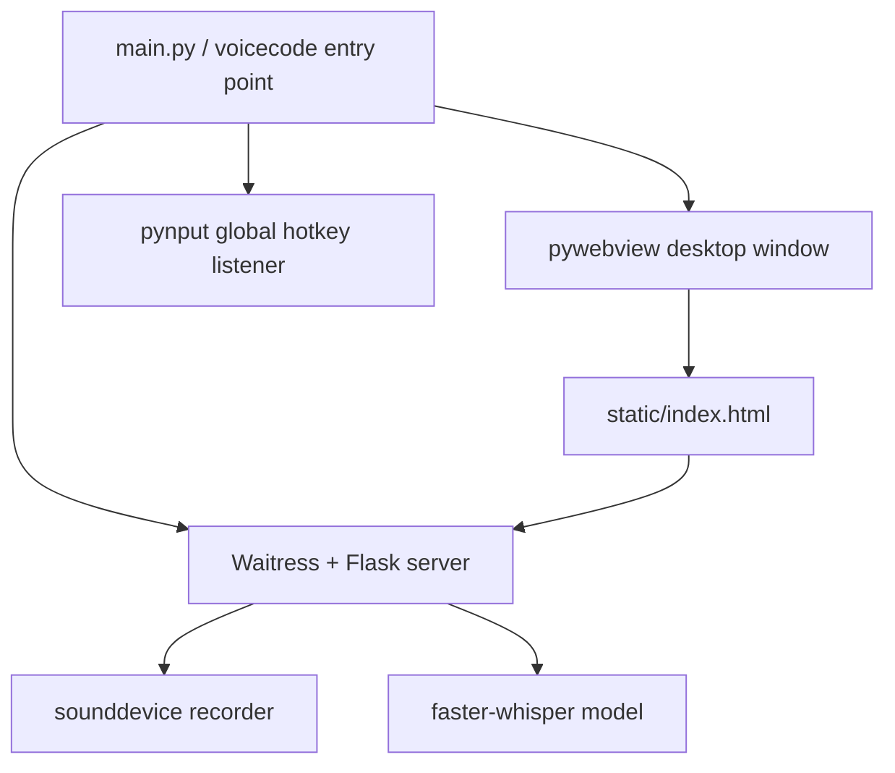

# Architecture

VoiceCode is a small local desktop application with four main parts:

## Runtime model

- The Flask app binds to `127.0.0.1` only.
- Waitress runs in a daemon thread so the webview can own the desktop main thread.
- Recording state is guarded by a re-entrant lock.
- Whisper model use and reloads are guarded by a re-entrant lock.
- Model reload state is exposed through `GET /status`.
- Cancellation uses a token so stale transcription results do not get pushed to the UI after cancel.

## Source layout

- `app.py` and `main.py` are thin compatibility wrappers; `src/voicecode/app.py` and `src/voicecode/main.py` are the authoritative implementations.
- `src/voicecode/` contains the installable package used by `python -m voicecode` and the `voicecode` console script.
- `static/index.html` loads split frontend assets from `static/css/app.css` and focused modules under `static/js/`: `i18n.js`, `dom.js`, `modal.js`, `api.js`, `config.js`, `hotkey.js`, `settings.js`, `recorder.js`, `history.js`, `status.js`, and `app.js`.
- `tests/test_app_smoke.py` verifies the root compatibility files and packaged copies stay synchronized.

## Encoding and diagnostics

Startup scripts and Python entry points force UTF-8 console I/O where possible. Logs and error responses are intentionally English to make release diagnostics readable across PowerShell, cmd, CI, and GitHub issues.

## Optional tray support

Tray support is disabled by default and can be tested with `VOICECODE_ENABLE_TRAY=1` after installing the optional `.[tray]` extra. The feature is optional to avoid forcing extra desktop dependencies on all users.
