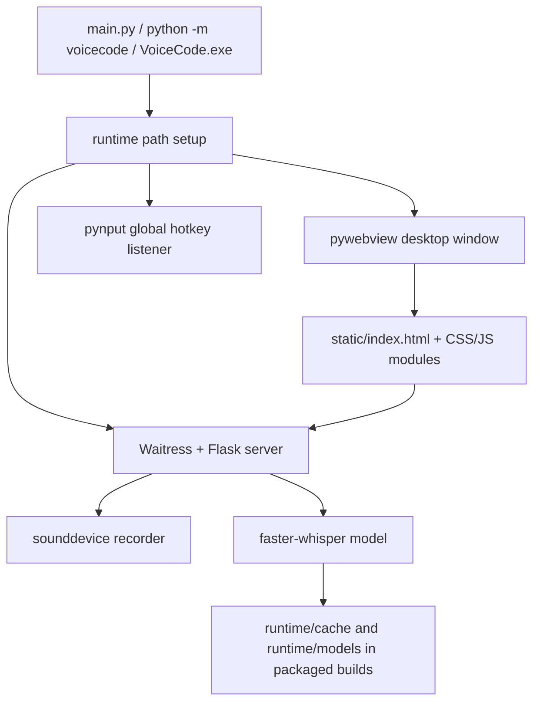

# Architecture

VoiceCode is a small local desktop application with packaged Windows release support.



## Runtime model

- The Flask app binds to `127.0.0.1` only.
- Waitress runs in a daemon thread so the webview can own the desktop main thread.
- Startup polls `/health` and verifies that the returned `pid` matches the current process.
- If `/health` belongs to another VoiceCode process, startup fails with a clear repeated-launch error.
- If another service returns `200` on `/health` but does not expose a VoiceCode `pid`, startup fails with a port-conflict error.
- Recording state is guarded by a re-entrant lock.
- Whisper model use and reloads are guarded by a re-entrant lock.
- Model reload state is exposed through `GET /status` and `GET /models`.
- A single-worker executor serializes asynchronous model loads/reloads.
- Cancellation uses a token so stale transcription results do not get pushed to the UI after cancel.

## Runtime paths

`src/voicecode/runtime.py` configures packaged runtime paths before importing the desktop and server modules.

Development runs keep normal user cache behavior unless `VOICECODE_RUNTIME_DIR` is explicitly set. PyInstaller builds default to:

```text
<install-dir>\runtime
<install-dir>\runtime\cache
<install-dir>\runtime\models
```

The launcher sets Hugging Face and transformer cache variables with `setdefault`, so advanced users can still override them externally.

Config, logs, and history remain user-writable and outside the installed package by default:

- `%APPDATA%\VoiceCode\config.json`
- `%APPDATA%\VoiceCode\logs\voicecode.log`
- `%APPDATA%\VoiceCode\history.jsonl`

This follows the project constraint that config must not be written into the installed package directory while still keeping large packaged runtime downloads under the selected installation folder.

## Source layout

- `app.py` and `main.py` are thin compatibility wrappers.
- `src/voicecode/app.py`, `src/voicecode/main.py`, and `src/voicecode/runtime.py` are the authoritative runtime implementation.
- `src/voicecode/__main__.py` configures packaged runtime/cache paths, locates packaged static assets, and delegates to `voicecode.main.run`.
- `static/index.html` loads split frontend assets from `static/css/app.css` and focused modules under `static/js/`: `i18n.js`, `dom.js`, `modal.js`, `api.js`, `config.js`, `hotkey.js`, `settings.js`, `recorder.js`, `history.js`, `status.js`, and `app.js`.
- `src/voicecode/static/` is the packaged static copy.
- `tests/test_app_smoke.py` verifies compatibility wrappers, static asset synchronization, API behavior, startup PID checks, reload races, runtime cache paths, and packaging file presence.

## Packaging architecture

The recommended Windows release pipeline is:


PyInstaller collects Python, native libraries, static UI files, and Python dependencies into `_internal`. Inno Setup wraps the one-folder app into a standard installer that lets the user select the destination directory and creates Start Menu/optional desktop shortcuts.

Generated packaging outputs are ignored by `packaging/installer/.gitignore`.

## Encoding and diagnostics

Startup scripts and Python entry points force UTF-8 console I/O where possible. Logs and error responses are intentionally English to make release diagnostics readable across PowerShell, cmd, CI, and GitHub issues.

## Optional tray support

Tray support is disabled by default and can be tested with `VOICECODE_ENABLE_TRAY=1` after installing the optional `.[tray]` extra. The feature is optional to avoid forcing extra desktop dependencies on all users.
