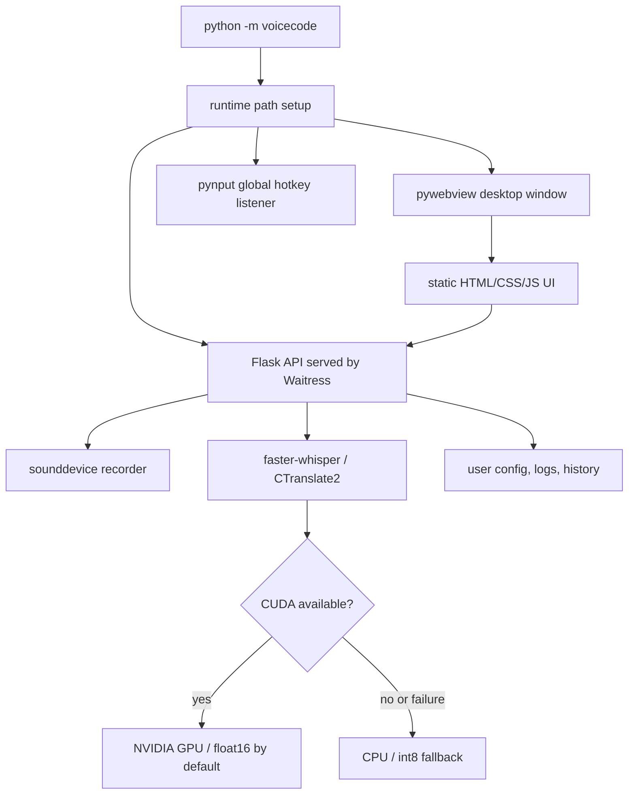

# Architecture

VoiceCode is a compact local-first desktop app. The installable package under `src/voicecode` is authoritative; root `app.py` and `main.py` are compatibility wrappers.

```mermaid
flowchart TD
  A["python -m voicecode"] --> B["runtime path setup"]
  B --> C["Flask API served by Waitress"]
  B --> D["pywebview desktop window"]
  B --> E["pynput global hotkey listener"]
  D --> F["static HTML/CSS/JS UI"]
  F --> C
  C --> G["sounddevice recorder"]
  C --> H["faster-whisper / CTranslate2"]
  H --> I{"CUDA available?"}
  I -->|yes| J["NVIDIA GPU / float16 by default"]
  I -->|no or failure| K["CPU / int8 fallback"]
  C --> L["user config, logs, history"]
```

## Runtime boundaries

- HTTP is bound to `127.0.0.1` only.
- Startup checks `/health` and verifies the returned PID belongs to the current process.
- Config, logs, history, and model caches are user-writable and never stored inside the installed package directory by default.
- Non-empty JSON request bodies must be JSON objects before an endpoint performs side effects.

## Key modules

| Path | Responsibility |
| --- | --- |
| `src/voicecode/app.py` | Flask routes, config validation, recorder, Whisper model lifecycle, transcription |
| `src/voicecode/main.py` | desktop startup, pywebview window, global hotkey callback, server readiness checks |
| `src/voicecode/runtime.py` | runtime/cache path configuration for explicit runtime roots |
| `src/voicecode/static/` | packaged web UI assets |
| `static/` | source-tree UI assets mirrored with packaged assets and checked by tests |

## Inference model lifecycle

1. Select a model (`tiny`, `base`, `small`, `medium`, `large-v3`, `distil-large-v3`).
2. Resolve device and compute type from config and environment overrides.
3. Prefer CUDA when available and configured as `auto` or `cuda`.
4. Load `faster-whisper.WhisperModel` with cache/download root hints.
5. If CUDA load or inference fails, reload the same model on `cpu/int8`.
6. Expose status through `/status`, `/models`, `/hardware`, `/diagnostics`, and `/stats`.

## Thread safety

| Resource | Guard |
| --- | --- |
| Whisper model | `model_lock` (`threading.RLock`) |
| Config file I/O | `_config_lock` |
| Audio buffer and active flag | `Recorder._lock` (`threading.RLock`) |
| Model reload state | `_model_state_lock` |
| Cancellation token | `_cancel_lock` |
| Typing callback state | `_typing_lock` in `main.py` |

## Extension points

- Add more languages by extending validation, UI options, and prompts.
- Add transcription post-processing in `_post_process_text`.
- Integrate local workflows through `/transcribe` instead of driving the UI.
- Add model metadata in `MODEL_INFO` while keeping validation strict.
