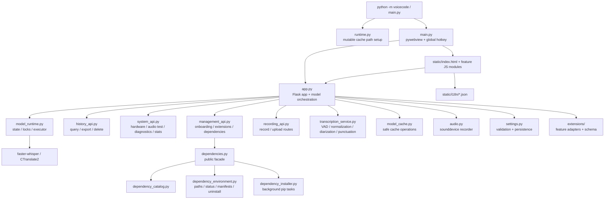
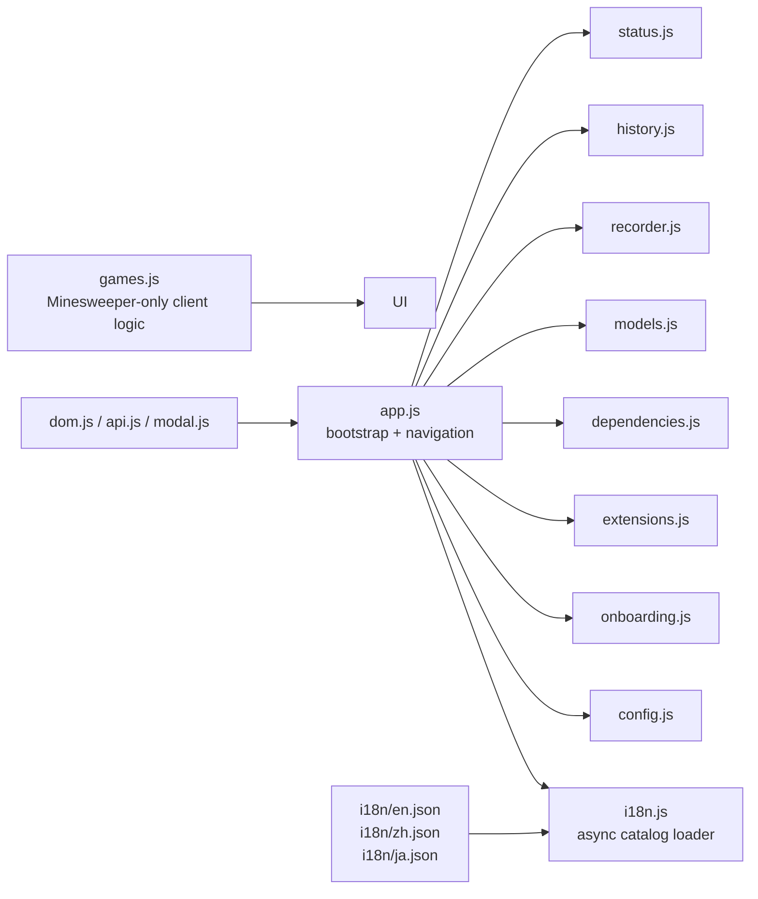
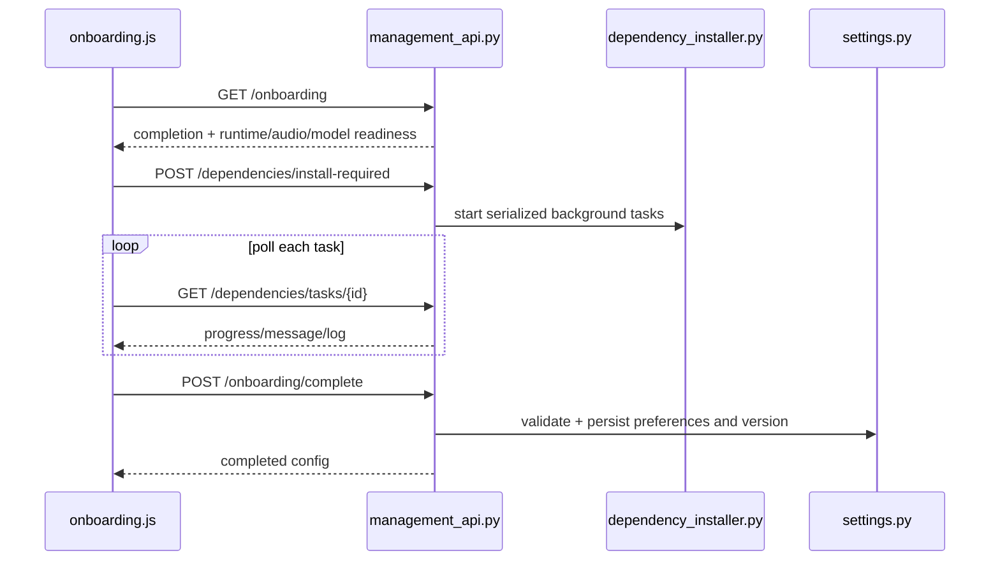
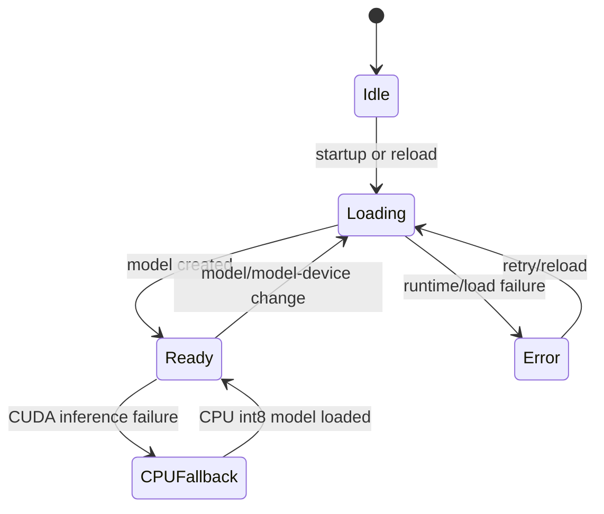

# Architecture

VoiceCode is a local-first desktop application: pywebview hosts a static web UI, Waitress serves a loopback-only Flask API, and faster-whisper/CTranslate2 performs inference in the same Python process.

## Runtime boundaries

```mermaid
flowchart TD
  Entry["python -m voicecode / main.py"] --> Runtime["runtime.py\nmutable cache path setup"]
  Entry --> Desktop["main.py\npywebview + global hotkey"]
  Desktop --> Server["app.py\nFlask app + model orchestration"]
  Server --> Mgmt["management_api.py\nonboarding / extensions / dependencies"]
  Server --> HistoryAPI["history_api.py\nquery / export / delete"]
  Server --> SystemAPI["system_api.py\nhardware / audio test / diagnostics / stats"]
  Server --> ModelRuntime["model_runtime.py\nstate / locks / executor"]
  Server --> Recording["recording_api.py\nrecord / upload routes"]
  Server --> Transcription["transcription_service.py\nVAD / normalization / diarization / punctuation"]
  Server --> ModelCache["model_cache.py\nsafe cache operations"]
  ModelRuntime --> Whisper["faster-whisper / CTranslate2"]
  Server --> Audio["audio.py\nsounddevice recorder"]
  Server --> Settings["settings.py\nvalidation + persistence"]
  Server --> Extensions["extensions/\nfeature adapters + schema"]
  Mgmt --> DependencyFacade["dependencies.py\npublic facade"]
  DependencyFacade --> Catalog["dependency_catalog.py"]
  DependencyFacade --> Environment["dependency_environment.py\npaths / status / manifests / uninstall"]
  DependencyFacade --> Installer["dependency_installer.py\nbackground pip tasks"]
  Desktop --> UI["static/index.html + feature JS modules"]
  UI --> Catalogs["static/i18n/*.json"]
  UI --> Server
```

The HTTP server binds only to `127.0.0.1`. Startup polls `/health` and verifies the returned PID matches the current process so repeated launches or unrelated services on the configured port fail clearly.

## Backend module boundaries

| Module | Responsibility |
| --- | --- |
| `app.py` | Flask construction, request/security policy, compatibility helpers, model load orchestration, model routes, blueprint wiring |
| `model_runtime.py` | model state lock, model lock, execution profile, single-worker executor lifecycle |
| `model_cache.py` | cached model discovery, size caching, containment checks, safe deletion |
| `transcription_service.py` | extension-aware audio preprocessing and transcript finalization |
| `recording_api.py` | microphone recording and direct upload/sample transcription routes |
| `management_api.py` | First-start state, extension config/action routes, dependency routes |
| `history_api.py` | History filtering, export, single-entry deletion, clear |
| `system_api.py` | Hardware, microphone device/test, diagnostics, process/GPU stats |
| `dependency_catalog.py` | Immutable dependency metadata and feature mapping |
| `dependency_environment.py` | Isolated directory resolution, import inspection, manifests, safe removal |
| `dependency_installer.py` | Serialized background pip installs and bounded task retention |
| `dependencies.py` | Stable compatibility facade for callers/tests |
| `settings.py` | Defaults, nested merge, validation, user-writable paths |
| `extensions/registry.py` | Extension discovery, effective config, UI schema, config-aware dependency requirements |

Blueprints receive explicit context callables rather than importing mutable `app.py` globals. This keeps tests able to override model/audio/config state while preventing route modules from owning inference lifecycle state.

## Frontend modules

```mermaid
flowchart LR
  App["app.js\nbootstrap + navigation"] --> I18n["i18n.js\nasync catalog loader"]
  App --> Config["config.js"]
  App --> Onboarding["onboarding.js"]
  App --> Extensions["extensions.js"]
  App --> Dependencies["dependencies.js"]
  App --> Models["models.js"]
  App --> Recorder["recorder.js"]
  App --> History["history.js"]
  App --> Status["status.js"]
  Games["games.js\nMinesweeper-only client logic"] --> UI
  Shared["dom.js / api.js / modal.js"] --> App
  CatalogJSON["i18n/en.json\ni18n/zh.json\ni18n/ja.json"] --> I18n
```

`app.js` waits for the English catalog before translating or bootstrapping feature panels. `loadConfig()` then loads the selected catalog and reapplies translations. Feature-specific rendering is separated: extension controls no longer live in history code, and first-start behavior has its own module. `games.js` is a small non-module script that owns only the Minesweeper board, timer, difficulty selector, and localized status; no card-game runtime is included.

## First-start lifecycle

```mermaid
sequenceDiagram
  participant UI as onboarding.js
  participant API as management_api.py
  participant Dep as dependency_installer.py
  participant Config as settings.py
  UI->>API: GET /onboarding
  API-->>UI: completion + runtime/audio/model readiness
  UI->>API: POST /dependencies/install-required
  API->>Dep: start serialized background tasks
  loop poll each task
    UI->>API: GET /dependencies/tasks/{id}
    API-->>UI: progress/message/log
  end
  UI->>API: POST /onboarding/complete
  API->>Config: validate + persist preferences and version
  API-->>UI: completed config
```

Skipping setup records intent but does not bypass normal runtime errors. The guide can be reset from the About page.

## Dependency safety

- The isolated path is inserted after application/standard-library paths but before global site-packages; `.pth` files are not executed.
- The install target is `VOICECODE_DEP_DIR`, packaged runtime `runtime/dependencies`, or source-tree `VOICE_DEP`.
- `pip --target` runs in a background task; one install executes at a time.
- Catalog package-index specifications are used by default; mutable GitHub branches are not part of the normal install path.
- Free disk space and a cross-process install lock are checked before pip starts.
- Tasks are persisted, cancellable, time-limited, and terminate the pip process tree on cancellation.
- Successful installs write manifests under `.voicecode/`.
- Uninstall resolves every path and refuses removal outside the dependency root.
- Files referenced by another manifest are retained.
- Task history is bounded and logs expose only recent lines through the API.

## Model cache root resolution

1. `VOICECODE_MODEL_DIR` when set;
2. `<VOICECODE_RUNTIME_DIR>/models` for packaged/runtime overrides;
3. `<project>/models` for source-tree compatibility.

The model manager only deletes known cache candidates below this root and refuses to delete the active model.

## Inference model lifecycle

```mermaid
stateDiagram-v2
  [*] --> Idle
  Idle --> Loading: startup or reload
  Loading --> Ready: model created
  Loading --> Error: runtime/load failure
  Ready --> Loading: model/model-device change
  Ready --> CPUFallback: CUDA inference failure
  CPUFallback --> Ready: CPU int8 model loaded
  Error --> Loading: retry/reload
```

Model state and the model object use separate locks. Reload work runs in the executor, while transcription and model replacement remain guarded by `model_lock`.

## Thread safety

| Resource | Guard |
| --- | --- |
| Whisper model | `model_lock` (`threading.RLock`) |
| Config file I/O | `_config_lock` |
| Audio buffer and active flag | `Recorder._lock` (`threading.RLock`) |
| Model reload state | `_model_state_lock` |
| Cancellation token | `_cancel_lock` |
| Global typing flag | `_typing_lock` |
| Dependency task map | dependency installer `_task_lock` |
| pip install serialization | dependency installer `_install_lock` |
| Hotkey modifier set | listener-local lock |

## Packaging boundary

Static assets exist twice: root `static/` for source-tree compatibility and `src/voicecode/static/` for wheel execution. Tests require byte-for-byte synchronization, including external JSON catalogs. See [PACKAGING.md](PACKAGING.md) and [RELEASING.md](RELEASING.md).

## Web security boundary

The server binds to loopback, validates loopback Host names, rejects foreign Origins on mutation requests, and requires the per-process API token for mutations. Responses apply CSP, anti-framing, `nosniff`, no-referrer, and restrictive permissions headers. Mutation audit logs contain request IDs and paths but never request bodies or tokens.

## Extension execution pipeline

Silero VAD compacts detected speech before Whisper. Punctuation restoration runs after text-mode and Chinese normalization. When timestamped segments and audio are available, pyannote diarization assigns the speaker with maximum temporal overlap to each Whisper segment. Heavy adapters are lazy-loaded and expose `operational`, `experimental`, dependency-missing, and runtime-error states.

## Windows packaged runtime (v0.2.0)

The Windows launcher acquires a per-session named mutex before starting Waitress. A repeat launch restores the existing pywebview window and exits successfully. Startup verifies both `/health` (including the current PID) and `/`; a bundle missing frontend assets is rejected before the 404 page can become the desktop UI. The maintained installer stores embedded Python/pip, optional dependencies, models, and caches below the selected `<install-dir>/runtime`. The build front-loads validated/retried embedded-runtime downloads and preserves their cache across clean PyInstaller work builds. Release CI then performs an actual silent install, payload/catalog/pip verification, and uninstall before artifact upload. User-created runtime files are outside Inno Setup's installed-file manifest and may survive uninstall for reuse.

## Model operation state

Model operations expose terminal and active phases rather than a single ambiguous loading flag. Active states are `checking`, `downloading`, and `loading`; first launch can use `awaiting_selection`; terminal states include `ready`, `error`, `skipped`, and `not_loaded`. State snapshots include the target model, cache completeness, approximate bytes, speed, elapsed/stalled time, endpoint, cache path, structured error code, sanitized technical details, retryability, and suggestion codes. A failed replacement leaves the previous model usable but reports the replacement as `error` so the UI does not falsely claim success.

## Desktop lifecycle additions

The desktop layer owns the tray, hotkey listener, native clipboard bridge, single-instance mutex, stale-instance recovery, and final frozen-process exit. Model operations use verified cache snapshots and a daemon serial executor; the HTTP service remains bound to `127.0.0.1`.
