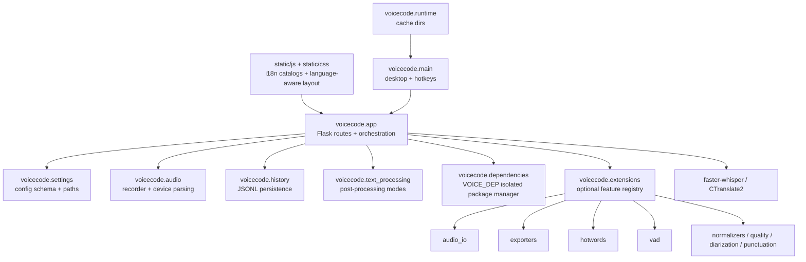

# Modules

VoiceCode keeps `voicecode.app` as the local API entry point, but feature code should live in focused modules.

## Rules for adding features

1. Keep the core path simple: record audio, transcribe locally, return text.
2. Add optional behavior in a focused module first.
3. Wire modules into `voicecode.app` only at route/service boundaries.
4. Validate config in `voicecode.settings` before side effects.
5. Keep default dependencies small; put heavyweight integrations behind optional extras or VOICE_DEP-managed downloads.
6. Every visible label needs a `data-i18n` key and complete English/Chinese/Japanese catalog entries.
7. Add tests for module behavior, route behavior, static asset synchronization, and i18n catalog completeness.

## Current modules

| Module | Public responsibility |
| --- | --- |
| `voicecode.settings` | Defaults, validation, config/log/history path helpers, environment flags |
| `voicecode.audio` | `Recorder` and `normalize_audio_device` |
| `voicecode.history` | append/read/clear transcript history files |
| `voicecode.text_processing` | post-process transcripts for plain, coding, Markdown, and prompt modes |
| `voicecode.runtime` | runtime/cache path environment setup |
| `voicecode.dependencies` | isolated dependency catalog, install task tracking, VOICE_DEP manifests, safe uninstall |
| `voicecode.main` | app startup, server readiness, pywebview, hotkey typing |
| `voicecode.app` | HTTP routes, JSON validation, Whisper lifecycle, dependency endpoints, endpoint orchestration |
| `static/js/i18n.js` | English/Chinese/Japanese UI catalogs; every non-English catalog must cover all English keys |
| `static/js/dom.js` | DOM handles, translation application, language attributes, shared UI helpers |
| `static/js/settings.js` | settings event handlers, dedicated language module behavior, language-sensitive refreshes |
| `static/css/app.css` | responsive layout and `html[data-ui-language]` language-specific spacing rules |
| `voicecode.extensions.base` | extension protocol and status shape |
| `voicecode.extensions.registry` | extension discovery, effective config, and status reporting |
| `voicecode.extensions.audio_io` | upload/sample validation and temporary audio file handling |
| `voicecode.extensions.exporters` | JSON/TXT/SRT/VTT transcript export |
| `voicecode.extensions.hotwords` | prompt augmentation for project-specific terms |
| `voicecode.extensions.vad` | VAD configuration adapter for faster-whisper |
| `voicecode.extensions.zh_normalizer` | optional Chinese spacing, punctuation, and script normalization |
| `voicecode.extensions.quality` | optional WER/CER helper shell using jiwer |
| `voicecode.extensions.diarization` | optional speaker diarization adapter shell |
| `voicecode.extensions.punctuation` | optional punctuation restoration adapter shell |

## Candidate future modules

| Module | Purpose |
| --- | --- |
| `voicecode.audio_io` | file decoding, resampling, max-duration checks |
| `voicecode.exporters` | SRT, VTT, JSON transcript exports |
| `voicecode.vad` | optional Silero or other VAD adapters |
| `voicecode.normalizers` | language-specific text normalization |
| `voicecode.quality` | optional WER/CER measurement helpers |
| `voicecode.diarization` | optional speaker diarization for batch/file transcription |
| `voicecode.features` | optional internal feature registry |
